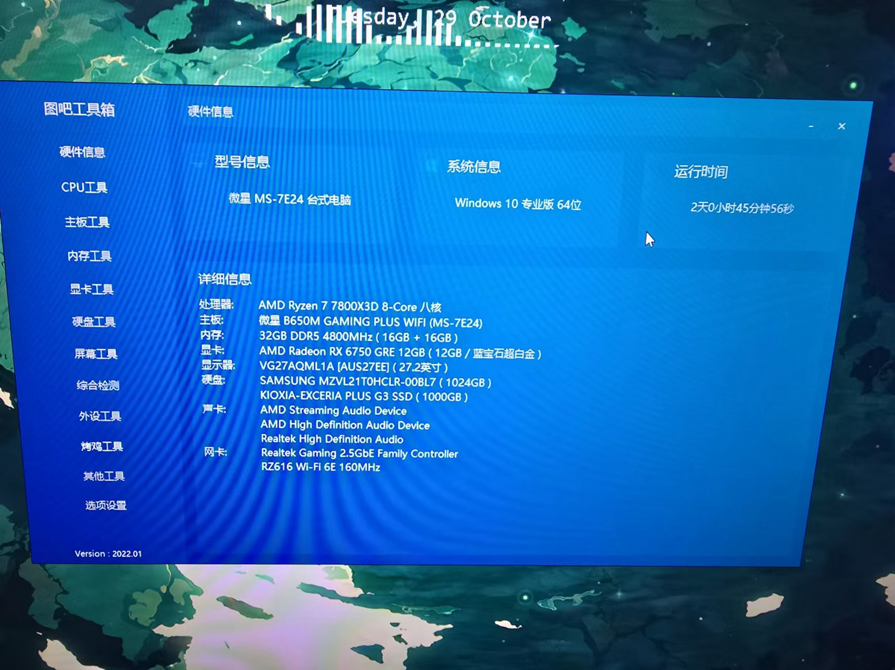

# MSI-B650M-GAMING-PLUS-Hackintosh
### 版本
- macOS Sequoia
- macOS Ventura
- macOS Sonoma
- macOS Monterey
- macOS Big Sur
- macOS Catalina

### 具体配置如下：

| 类型          | 具体型号                            |
| ------------- | ----------------------------------- |
| **主板**      | **MSI-B650M-GAMING-Plus-Wifi**           |
| **cpu**       | **AMD-Ryzen7 7800X3D**                  |
| **显卡**      | **AMD Radeon RX 6700GRE 12GB ** |
| **网卡**      | **LucyRTL8125*             |
| 内存          | 32 GB 4800MHZ DDR5        |
| 硬盘          | KIOXIA G3 SSD                 |
| SMBIOS        | iMacPro1.1                   |

### 已测试可正常使用功能：

网卡，声卡，无线网卡无解，独显硬解正常，可登入ID

### 注意事项
* 安装后删掉config文件，将名为（安装后的config）改名为config，即可驱动显卡
* 自行更换三码
* BIOS设置：安全启动，CSM，快速启动关掉，Bios需关闭Resizable BAR

